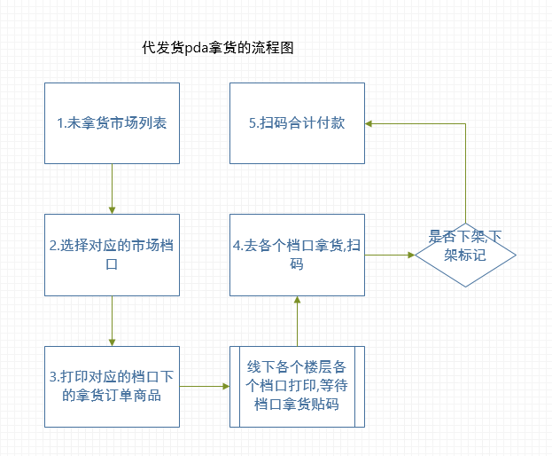
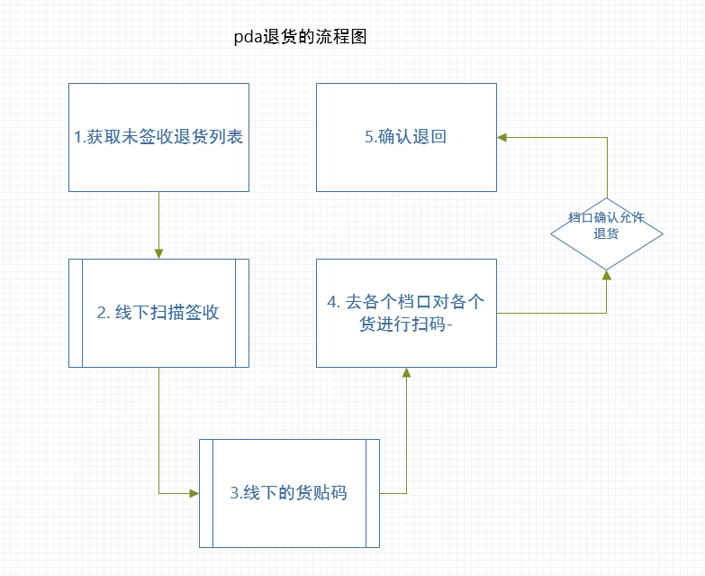

## 前置步骤
下单后,订单分配到时进入抢单池,还是直接进入到代发流程.这个之前拿货员那边有反馈说有时候会出现订单既没有在抢单池中,也没有出现在pda中.这个需要看对应的抢单的代码.不过之前有说这个流程先暂时放一放.

## pda拿货流程

目前这个流程下涉及的几个问题.除了之前提出了一个需要添加楼层筛选/排序的新需求以及对于重新上架的标记问题外.还有以下问题
- 步骤1.出现了拿货人员和市场不匹配的情况.这个在代码逻辑上比较清晰,应该不会出现代码的问题.怀疑可能是正式环境下数据录入的时候关联人员有问题.
- 步骤1.有可能出现加载过慢的情况,这个需要对于数据查询进行优化.
- 步骤3.出现的订单商品sku过长导致的被出现省略号,而对应的规则下,核心的sku在后方,导致被忽略的问题.能否给出一个有效的sku缩写策略?
- 步骤5.扫码付款的情况,商品过多的情况下会出现付款过慢的情况.可以考虑合并获取信息,批量打印日志和合并账户金额修改.情况见文档[pda相关接口.md](pda相关的接口.md).

## pda退货流程

目前出现的几个问题.
- 步骤1.获取未签收退货列表加载过慢的问题.目前分析应该是退货日志表缺少一个索引.目前在测试环境下已经添加了对应的索引.已经大大加快加载速度.另外正式环境王志龙应该也同步添加了一个索引上去.
- 步骤4.扫码有一定概率会出现闪退的情况.根据拿货人员反馈和扫码数目关联不大.根据分析有可能是特定的退换货的数据格式有问题导致闪退.需要pda方进行分析处理.

## 网络问题
根据拿货人员反馈,之前在网络过慢的情况下会有一定的问题.现在已经提供了wifi的情况下条件会得到一定的改善.不过建议在pda中添加弹窗提示.对于是网络问题还是数据错误都会进行弹窗提示.
